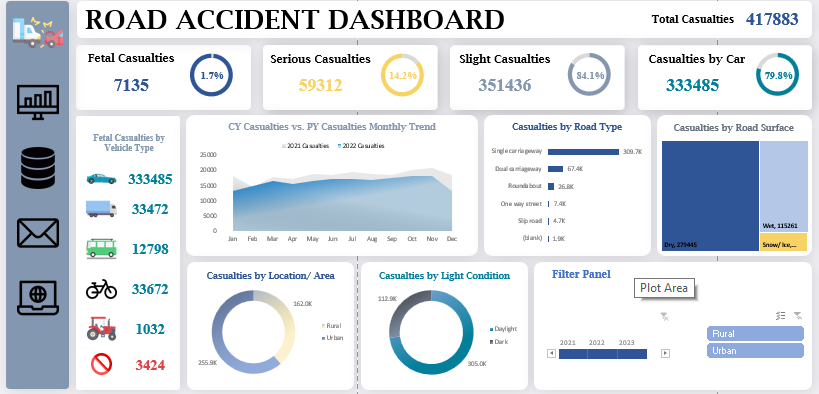

# Road Accident Data Analysis Dashboard

## Overview
This repository contains a dashboard created in Excel for analyzing road accident data. The project aims to provide insights and visualizations to better understand trends and patterns in road accidents.

## Screenshots

## Tools Used
- Excel for data visualization.

## Data Sources
- [Provide information about the source(s) of your road accident data.]
